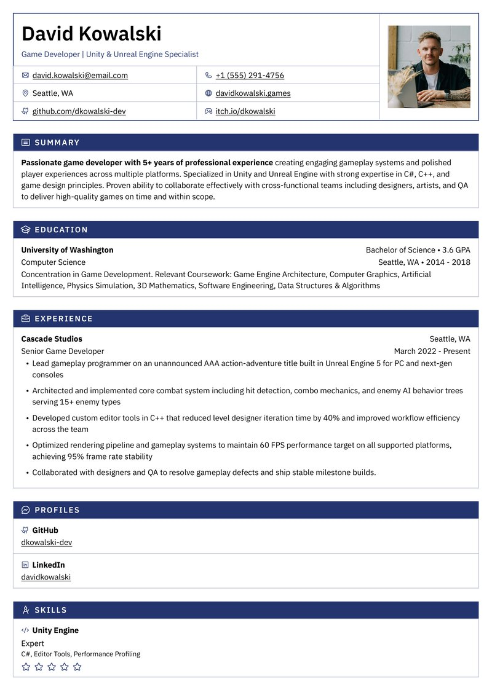
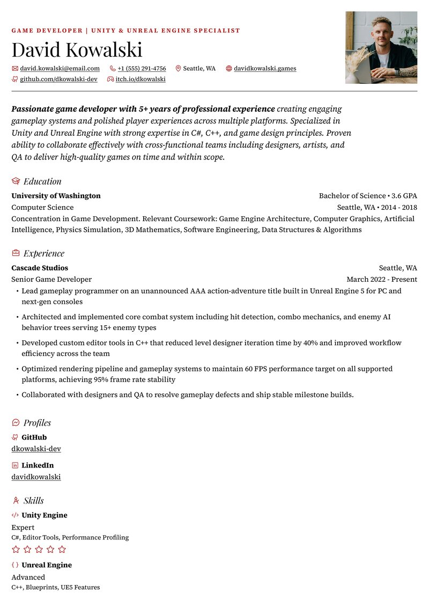

> [!IMPORTANT]
> **Repository moved:** Reactive Resume now lives at **[`reactive-resume/reactive-resume`](https://github.com/reactive-resume/reactive-resume)** on GitHub.
> **Docker Hub stays at `amruthpillai/reactive-resume`.** GHCR images publish to `ghcr.io/reactive-resume/reactive-resume`.
> GitHub Sponsors and Open Collective funding links remain unchanged.

<div align="center">
  <a href="https://rxresu.me">
    
  </a>

  <h1>Reactive Resume</h1>

  <p>Reactive Resume is a free and open-source resume builder for writing resumes and cover letters, checking your work, and tracking job applications.</p>

  <p>
    <a href="https://rxresu.me"><strong>Get Started</strong></a>
    ·
    <a href="https://docs.rxresu.me"><strong>Learn More</strong></a>
  </p>

  <p>
    
    
    
    
    <a href="https://discord.gg/aSyA5ZSxpb"></a>
    <a href="https://crowdin.com/project/reactive-resume"></a>
    <a href="https://github.com/sponsors/AmruthPillai"></a>
    <a href="https://opencollective.com/reactive-resume/donate"></a>
  </p>

  <br />
  <a href="https://vercel.com/open-source-program">
    
  </a>
</div>

---

Create a free account, import an existing resume or start fresh, and see the finished page as you write. Download a PDF, Word, Markdown, or JSON file, or share your resume with a public link. You can also run the whole application on your own infrastructure.

You own your data. The codebase is open source under the MIT license, with no tracking, no ads, and no paid tier. Optional AI features use a provider you connect; hosting and provider usage may have their own costs.

> [!NOTE]
> This branch contains the upcoming **v6** release. Read [what's new in v6](docs/guides/whats-new-in-v6.mdx) and the [release notes](docs/changelog/index.mdx) for the full changes. Existing self-hosted installations should follow [Migrating from v5](docs/self-hosting/upgrading-to-v6.mdx).


## Features

**Write, Design, and Check**

- Redesigned editor with inline content editing and click-to-select on the page
- Live PDF preview and browser downloads powered by Forme, rendered in a background worker
- Rich text, custom sections, drag-and-drop ordering, and structured dates with consistent formatting
- Autosave, local recovery of unsaved resume drafts, and up to 200 undo steps
- Phone and tablet layouts, keyboard shortcuts, and a searchable command bar

**Templates and Customization**

- 17 templates, including the new Porygon and Smeargle, previewed with your own content
- One-column, two-column, and ATS-safe template filters
- Font presets, custom fonts, colors, spacing, A4 and Letter paper, and left or right sidebars
- Fit overflowing content by adjusting density, margins, and text size
- Custom Styles written as Semantic CSS, with an element picker on the page

**Resume Checks**

- Readability checks with findings pinned to the relevant lines
- Job-posting keyword matching and a view of the text hiring software reads
- Checks on the exported PDF, plus an optional AI writing review
- A public [ATS checker](https://rxresu.me/ats-checker) that reads PDFs in your browser without an account

**Documents and Cover Letters**

- One searchable library for resumes and letters, with tags, sorting, and grid or list views
- Standalone cover letters with their own editor, exports, and version history
- Link a letter to a resume to keep its sender details and design in sync, or customize it independently
- Automatic and named versions you can preview and restore
- Trash with Undo and a 30-day recovery window

**Job Applications**

- List, Board, Insights, and Calendar views for tracking applications from Saved to Offer
- Save jobs from a URL or pasted posting; optional keyword search through Firecrawl, Tavily, or Exa
- Tailor a resume and draft a cover letter for a saved job
- Track contacts, notes, follow-ups, application outcomes, and the documents you sent
- Schedule interviews, export calendar events, and import or export applications as CSV

**AI Assistant**

- Assistant beside your resume or letter, with conversations tied to that document
- Proposed edits show what changes and why; accept or reject each suggestion
- Improve selected text, review writing, and draft letters from a resume and job posting
- Connect OpenAI, Anthropic, Google Gemini, OpenRouter, Ollama, or other supported providers and compatible endpoints
- Optional web search and page reading; self-hosters can configure shared AI and web-access providers

**Import, Export, and Sharing**

- Import Reactive Resume JSON, JSON Resume, LinkedIn data exports, PDF, and Word files
- JSON, LinkedIn, and readable PDF imports work without AI; Word imports require a connected provider
- Export resumes and letters as PDF, Word (DOCX), Markdown, or JSON
- Share resumes through public links with optional password protection and view/download statistics
- REST API and MCP server for document management, imports, exports, checks, and application workflows

**Privacy and Control**

- Self-host with Docker, Vercel, or Cloudflare Workers
- No tracking or ads; export your account data or delete your account
- Passkeys, two-factor authentication, and linked sign-in providers
- Multiple interface languages, light/dark/system themes, and reduced-motion support

## Templates

<table>
  <tr>
    <td align="center">
      
      <br /><sub><b>Azurill</b></sub>
    </td>
    <td align="center">
      
      <br /><sub><b>Bronzor</b></sub>
    </td>
    <td align="center">
      
      <br /><sub><b>Chikorita</b></sub>
    </td>
    <td align="center">
      
      <br /><sub><b>Ditto</b></sub>
    </td>
  </tr>
  <tr>
    <td align="center">
      
      <br /><sub><b>Gengar</b></sub>
    </td>
    <td align="center">
      
      <br /><sub><b>Glalie</b></sub>
    </td>
    <td align="center">
      
      <br /><sub><b>Kakuna</b></sub>
    </td>
    <td align="center">
      
      <br /><sub><b>Lapras</b></sub>
    </td>
  </tr>
  <tr>
    <td align="center">
      
      <br /><sub><b>Leafish</b></sub>
    </td>
    <td align="center">
      
      <br /><sub><b>Onyx</b></sub>
    </td>
    <td align="center">
      
      <br /><sub><b>Pikachu</b></sub>
    </td>
    <td align="center">
      
      <br /><sub><b>Rhyhorn</b></sub>
    </td>
  </tr>
  <tr>
    <td align="center">
      
      <br /><sub><b>Ditgar</b></sub>
    </td>
    <td align="center">
      
      <br /><sub><b>Meowth</b></sub>
    </td>
    <td align="center">
      
      <br /><sub><b>Scizor</b></sub>
    </td>
    <td align="center">
      
      <br /><sub><b>Porygon</b></sub>
    </td>
    <td align="center">
      
      <br /><sub><b>Smeargle</b></sub>
    </td>
  </tr>
</table>

## Quick Start

Use the [hosted app](https://rxresu.me) to start writing, or build this checkout locally with Docker and Docker Compose:

```bash
# Clone the repository
git clone --depth=1 https://github.com/reactive-resume/reactive-resume.git reactive-resume
cd reactive-resume

# Create your local configuration
cp .env.example .env
# Edit .env: set AUTH_SECRET and a separate ENCRYPTION_SECRET.
# Generate each secret with: openssl rand -hex 32

# Build the app and start PostgreSQL, Redis, and SeaweedFS
docker compose up -d --build

# Open http://localhost:3000 in your browser
```

This builds the checked-out source. For a deployment using published images, follow the [Docker guide](docs/self-hosting/docker.mdx). For source development, see the [development setup guide](docs/contributing/development.mdx).

## Tech Stack

| Category         | Technology                               |
| ---------------- | ---------------------------------------- |
| Web app          | React 19 SPA, TanStack Router, and Vite  |
| Server           | Hono on Node.js 24 or Cloudflare Workers |
| Language         | TypeScript                               |
| Monorepo         | pnpm and Turborepo                       |
| Database         | PostgreSQL with Drizzle ORM              |
| API              | oRPC, OpenAPI REST, and MCP              |
| Auth             | Better Auth                              |
| Styling          | Tailwind CSS                             |
| UI Components    | Base UI + shared UI package              |
| State Management | Zustand + TanStack Query                 |
| PDF rendering    | Forme, with PDF.js for the viewer        |
| Rich text        | TipTap                                   |
| Localization     | Lingui                                   |

## Documentation

The full documentation lives at [docs.rxresu.me](https://docs.rxresu.me):

| Guide                                                                                | Description                                  |
| ------------------------------------------------------------------------------------ | -------------------------------------------- |
| [Getting started](https://docs.rxresu.me/getting-started)                            | First-time setup and basic usage             |
| [What's new in v6](docs/guides/whats-new-in-v6.mdx)                                  | Changes and where familiar features moved    |
| [Checking your resume](docs/guides/checking-your-resume.mdx)                         | Readability, job match, and writing reviews  |
| [Using the assistant](docs/guides/using-the-assistant.mdx)                           | Ask for changes and review proposed edits    |
| [Writing a cover letter](docs/guides/writing-a-cover-letter.mdx)                     | Create a letter and link it to a resume      |
| [Tracking job applications](docs/guides/tracking-job-applications.mdx)               | Saved jobs, stages, interviews, and insights |
| [Exporting your resume](docs/guides/exporting-your-resume.mdx)                       | PDF, Word, Markdown, and JSON downloads      |
| [API](docs/guides/using-the-api.mdx) and [MCP](docs/guides/using-the-mcp-server.mdx) | Connect scripts and external assistants      |
| [Self-hosting](docs/self-hosting/docker.mdx)                                         | Deploy on your own infrastructure            |
| [Migrating from v5](docs/self-hosting/upgrading-to-v6.mdx)                           | Migrations and integration changes           |
| [Development setup](docs/contributing/development.mdx)                               | Local development environment                |
| [Project architecture](docs/contributing/architecture.mdx)                           | Codebase structure and package boundaries    |

## Self-Hosting

Reactive Resume supports Docker, Kubernetes, Vercel, and Cloudflare Workers. Each deployment runs the same application with PostgreSQL and upload storage.

[](https://vercel.com/new/clone?repository-url=https%3A%2F%2Fgithub.com%2Freactive-resume%2Freactive-resume&project-name=reactive-resume&repository-name=reactive-resume&env=AUTH_SECRET%2CENCRYPTION_SECRET&envDescription=Generate+two+independent+secrets+with+openssl+rand+-hex+32.+Keep+these+values+across+deployments.&envLink=https%3A%2F%2Fdocs.rxresu.me%2Fself-hosting%2Fvercel&stores=%5B%7B%22type%22%3A%22integration%22%2C%22protocol%22%3A%22storage%22%2C%22integrationSlug%22%3A%22neon%22%2C%22productSlug%22%3A%22neon%22%7D%2C%7B%22type%22%3A%22integration%22%2C%22protocol%22%3A%22storage%22%2C%22integrationSlug%22%3A%22upstash%22%2C%22productSlug%22%3A%22upstash-kv%22%7D%2C%7B%22type%22%3A%22blob%22%2C%22access%22%3A%22private%22%7D%5D)

Vercel provisions Neon PostgreSQL, private Blob storage, and Upstash Redis through its deployment wizard. Supply two persistent secrets and use the **Services** framework preset. Static assets run in the frontend service, and Hono serves the application routes and APIs from the backend service. See the [Vercel guide](docs/self-hosting/vercel.mdx) for setup, limits, and optional SMTP/OAuth configuration.

Cloudflare deployment requires **Workers Paid** and uses Static Assets, private R2 storage, SQLite Durable Objects, and PostgreSQL through Hyperdrive. Supply an existing PostgreSQL database and apply migrations before deployment. See the [Cloudflare guide](docs/self-hosting/cloudflare.mdx) for setup and runtime limits.

For Docker and Kubernetes, the application needs:

- **PostgreSQL** — Accounts, documents, applications, and assistant conversations
- **Upload storage** — A persistent local directory or an S3-compatible bucket, such as SeaweedFS
- **Redis** (optional) — Shared coordination across instances and resumable assistant replies
- **SMTP** (optional) — Verification and password-reset emails

> **PDF generation in v6** uses Forme in the browser and on the server. No Browserless, Chromium, or external print service is needed. Legacy `PRINTER_*` and `BROWSERLESS_*` environment variables can be removed.

Published releases are available from Docker Hub and GitHub Container Registry (`latest` tracks the latest stable release):

```bash
# Docker Hub
docker pull amruthpillai/reactive-resume:latest

# GitHub Container Registry
docker pull ghcr.io/reactive-resume/reactive-resume:latest
```

See the [Docker guide](docs/self-hosting/docker.mdx) or [Kubernetes guide](docs/self-hosting/kubernetes.mdx) for complete instructions. Self-hosters can also configure [shared AI and job-search services](docs/self-hosting/job-search-and-ai.mdx).

For a v5 upgrade, back up your database and uploads and stop all v5 instances before applying v6 migrations. Old visual style rules require a manual conversion; API and MCP integrations also have changes. Follow [Migrating from v5](docs/self-hosting/upgrading-to-v6.mdx).

## Support

Reactive Resume is and always will be free and open source. If it has helped you land a job or saved you time, please consider supporting continued development:

<p>
  <a href="https://github.com/sponsors/AmruthPillai">
    
  </a>
  <a href="https://opencollective.com/reactive-resume/donate">
    
  </a>
</p>

Other ways to support:

- Star this repository
- Report reproducible bugs and suggest actionable features
- Help other users in [GitHub Discussions](https://github.com/reactive-resume/reactive-resume/discussions/categories/q-a)
- Improve documentation
- Help with translations

<a href="https://blacksmith.sh/">
  
</a>

## Star History

<a href="https://www.star-history.com/?repos=reactive-resume%2Freactive-resume&type=date&legend=top-left">
 <picture>
   <source media="(prefers-color-scheme: dark)" srcset="https://api.star-history.com/chart?repos=reactive-resume/reactive-resume&type=date&theme=dark&legend=top-left" />
   <source media="(prefers-color-scheme: light)" srcset="https://api.star-history.com/chart?repos=reactive-resume/reactive-resume&type=date&legend=top-left" />
   
 </picture>
</a>

## Contributing

Every contribution helps, whether it is a typo fix or a new feature.

1. Fork the repository
2. Create a feature branch (`git checkout -b feature/amazing-feature`)
3. Commit your changes using Conventional Commits (`git commit -m 'feat: add amazing feature'`)
4. Push to the branch (`git push origin feature/amazing-feature`)
5. Open a Pull Request

See the [development setup guide](https://docs.rxresu.me/contributing/development) for how to run the project locally.

Maintainers review the [`status: needs triage` queue](https://github.com/reactive-resume/reactive-resume/issues?q=is%3Aissue+is%3Aopen+label%3A%22status%3A+needs+triage%22)
weekly. Triaged bugs become `status: confirmed`; feature proposals become `status: accepted`; reports that need details become
`status: needs info`.

## License

[MIT](./LICENSE) — do whatever you want with it.
