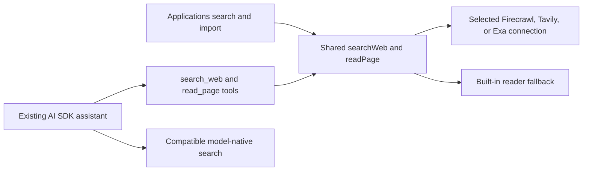

# Reliable job saving and application preparation

Status: implemented; local verification complete. Commercial-provider and native-model live checks await maintainer-supplied test credentials. Release has not been published.
Date: September 30, 2026.

Delivery decision: implement and release the full scope together, including three external search/read providers and AI SDK integration. The work order below describes dependencies within one implementation effort, not incremental releases. This supersedes the earlier proposal to add providers later.

## Product promise

Bring a job you found elsewhere into Reactive Resume, prepare your documents, and keep track of what happened. The complete manual workflow requires no new API account. Optional services improve it without interrupting it with setup.

Reactive Resume is a free, open-source, self-hostable application. Release scope must fit limited maintenance capacity and cannot depend on subsidizing unlimited search, scraping, or model usage.

## User experience

### Save a job

Keep the entry point in Applications. Accept a job link or pasted description, fill available details, and let the user correct the role and company before saving. Default a newly discovered job to **Saved**. Make recording an already-submitted application an explicit choice, with its date and documents.

Offer **Save job** and **Save and prepare resume**. Users can collect opportunities before deciding which deserve preparation. Saving does not require an AI provider or a web-service connection.

When a link cannot be read, preserve the draft and offer pasted text immediately. Explain incomplete or clipped descriptions before using them for preparation. Missing details stay unknown and editable.

### Prepare and track

Use the existing application details, document library, resume copies, assistant proposals, sent versions, contacts, and next-step features. A saved job holds:

- The saved posting and original source link.
- A selected resume or a copy made for this job.
- An optional cover letter.
- The next action and the employer's application link, when known.

Keep manual preparation complete. Offer AI assistance when an existing usable AI connection is available. Preserve the base resume and let the user review proposed edits.

**Open application** opens the external site. **Mark as applied** records the user's confirmation and the documents actually submitted. Opening a site or exporting a document does not advance the application stage.

### One optional web connection

Present a small **Web access** area in Integrations:

- **Built-in reader — Active:** reads supported public pages.
- **Search and enhanced reading — Optional:** searches the web and helps with pages the built-in reader cannot read.
- **Connect a service:** reveals provider and credential fields only when requested.

Ship Firecrawl, Tavily, and Exa together. Users choose one provider and enter one key; the same connection supplies search and reading. A server administrator can configure one connection for everyone; existing policy controls personal credentials. When server-managed, show that web access is provided by the server. Provider details belong in connection management, outside the save-job form.

No separate search, scraping, extraction, and research setup is required. AI continues to use the existing AI connection. Ordinary users need zero new accounts for the core workflow; external web access needs at most one optional connection. With no external connection, compatible AI providers can supply native assistant search through the existing AI account. Native search does not become a prerequisite for importing a link.

## Next-release scope

1. Correct Saved/Applied intent and defaults without disrupting users recording past applications.
2. Improve URL and pasted-text import: editable extracted details, retained input on failure, immediate paste recovery, and visible truncation or incomplete content.
3. Preserve the source link and saved description used for preparation; show retrieval information for fetched content. Refreshing a posting must not silently replace the evidence behind existing documents.
4. Connect saving to existing resume selection, copy-for-job, manual editing, and assistant review flows. Keep letters optional.
5. Make external application handoff and confirmed submission distinct, using existing sent-document history.
6. Support Firecrawl, Tavily, and Exa for both search and page reading through shared application-owned functions. Preserve existing Firecrawl credentials, custom server endpoints, URL protections, and built-in fallback.
7. Connect those same functions to the existing AI SDK assistant and support verified native-search configurations for OpenAI, Anthropic, and Gemini. Complete capability selection, source display, cancellation, and error handling in the same release.
8. Replace Firecrawl-specific settings and feature gates with one optional web connection and capability-based availability. Retain optional search without promoting broad job discovery as a new product promise.

These changes should reuse existing application records and pipeline stages. Preparation can be represented within Saved; additional stages and a new jobs subsystem are unnecessary for this release.

## Final technical design

### Provider choice

| External provider | Search              | Read a supplied URL | Reason to include                                                                 |
| ----------------- | ------------------- | ------------------- | --------------------------------------------------------------------------------- |
| Firecrawl         | Existing Search API | Existing Scrape API | Preserve current users, custom endpoints, and self-hosted deployments.            |
| Tavily            | Search API          | Extract API         | One alternative connection covers both operations.                                |
| Exa               | Search API          | Contents API        | A third independent backend covers both operations without another setup concept. |

These are three actual external search providers; native LLM search is additional support and does not substitute for the three-provider requirement. Each can be used independently. Supporting all three does not mean configuring or calling all three.

Keep the installed Firecrawl SDK. Implement the two small Tavily and Exa HTTP adapters with Node's built-in fetch and Zod response validation. The application needs their search/read endpoints, not their entire SDKs. Use the installed AI SDK's `tool()` to expose shared functions to the assistant; adding provider-specific AI SDK tool packages would duplicate the configuration and normalization needed by ordinary UI requests.

For Tavily imports, request Markdown extraction without query-based chunk reranking and inspect per-URL failures even on HTTP 200. For Exa imports, request page text rather than highlights or summaries and use the documented freshness controls; the older `livecrawl` option is deprecated. Search requests should avoid full-page extraction and generated answers. Fetch a selected result only when it is needed. [Tavily Search](https://docs.tavily.com/documentation/api-reference/endpoint/search), [Tavily Extract](https://docs.tavily.com/documentation/api-reference/endpoint/extract), [Exa Search](https://exa.ai/docs/reference/search), [Exa Contents](https://exa.ai/docs/reference/get-contents).

### Shared retrieval and job-specific parsing

Keep implementation in `packages/api/src/features/web-access/`, with configuration/service code, shared contracts, and one adapter file per external provider. Move the existing safe direct reader there. No new workspace package or general plugin system is needed.

Expose two server functions: `searchWeb` and `readPage`. They receive a server-resolved connection and an AbortSignal. Search returns normalized URL, title, and optional snippet; reading returns requested/resolved URL where known, content, format, retrieval time, method, truncation information, and optional HTML for the server-side JobPosting parser. A retrieval timestamp must not imply the provider fetched the origin at that moment. Retain a provider fetch timestamp when available.

Use small function adapters selected by the provider discriminant. No class hierarchy, dependency injection container, per-provider public router, or user-defined adapter code.

`applications/posting.ts` continues to own JobPosting parsing and job-specific behavior. Move the existing `job posting` query suffix out of generic search. Company research must receive the original company query. Keep the existing Applications API routes and map normalized search results back to their existing output contract where possible.

For reading, use the selected external provider when configured, then the built-in reader on a recoverable failure; with no connection, use the built-in reader directly. Preserve this existing Firecrawl behavior. Unsafe URLs and cancellation stop immediately. A successful response containing an empty page or obvious access challenge must not be treated as a successful posting import. Distinguish detected incompleteness from unknown completeness; do not claim that HTTP 200 proves a complete description.

Keep the existing 20,000-character application limit initially, but return and display truncation information. Do not create a separate raw-page storage system. Preserve the bounded posting snapshot used by the application and identify how it was obtained. Add nullable posting-source metadata to the existing application record, with corresponding DTO/export handling, rather than creating a new Job entity.

Optional AI extraction must not discard a successfully retrieved posting when the model fails. Return page-derived fields, saved text, and an enrichment warning so the user can complete the fields manually. Preserve truthful source fields and user corrections.

### Execution paths and selection rules

| Request                                         | Selection rule                                                                                                |
| ----------------------------------------------- | ------------------------------------------------------------------------------------------------------------- |
| Applications keyword search                     | Use the configured external connection directly; no model call. Without one, offer URL/text import.           |
| Applications URL import                         | Use `readPage`, then job parsing and optional AI enrichment. Native search is not an import dependency.       |
| Assistant search with an external connection    | Use that explicit connection through `search_web`, regardless of LLM vendor.                                  |
| Assistant search without an external connection | Use verified native search from the selected AI connection; otherwise report that search is unavailable.      |
| Assistant reads a URL                           | Use `read_page` with the selected reader or built-in reader. Requires a model capable of custom tool calling. |

An explicitly configured web connection wins over native search, so choosing a provider has predictable effects. Register one search mechanism per assistant run. Do not offer several competing search tools to the model or silently change paid providers after a failure. Native search failure should retain the conversation and explain the unavailable capability.

### AI SDK integration

Reuse the installed `ToolLoopAgent`, tool handlers, streaming, message persistence, and proposal review. The cookbook describes a wrapper around a service call, not a unified credentials service or automatic source adapter. [AI SDK tool model](https://ai-sdk.dev/docs/foundations/tools), [web-search cookbook](https://ai-sdk.dev/cookbook/node/web-search-agent).

- Add `search_web` and `read_page` function tools using server-injected handlers. Tool inputs never accept a user ID, API key, provider URL, or arbitrary request headers.
- Keep native `web_search` and `google_search` names distinct from the custom tool names. Existing stored OpenAI tool messages must remain readable.
- Replace the boolean `hasProviderNativeSearch` and hardcoded `web_search` prompt text with actual search/read capability information and the selected tool name. A reader-only configuration must not claim it cannot access URLs.
- Extend the current capability checks to documented direct OpenAI, Anthropic, and Gemini configurations. Verify the endpoint, model, and combination of native search with existing document tools. Unknown models and custom gateways must not inherit capabilities merely from a provider label.
- Keep OpenAI's Responses API selection where required. Test Anthropic's search enablement requirements and Gemini's native/custom tool compatibility. Use the external function tool when a model supports custom tools but the native combination is unsupported; do not add a second research agent to work around incompatibilities.
- Pass the agent run's cancellation signal into tool execution and provider requests. Reuse the existing 240-second run limit and bounded steps rather than creating another agent loop.
- Normalize custom tool source URLs for the UI and preserve native source parts. Custom tool results do not automatically become AI SDK `source-url` parts: explicitly derive and deduplicate the Sources list from typed search/read outputs as well as existing native parts. Only display validated public HTTP(S) links, and distinguish retrieved sources from unsupported generated citations.
- Update the shared `AgentTools` contracts, web tool statuses, error rendering, transcript export where applicable, and message replay when the selected AI/web provider changes. A failed search must not render as “Searched the web” success.

Native-search support is limited to verified model/endpoint combinations and documented clearly. At least one compatible configuration for each of OpenAI, Anthropic, and Gemini must be covered in the release checks. Native provider tool charges still apply; no additional search account is required. [Anthropic search](https://ai-sdk.dev/providers/ai-sdk-providers/anthropic#web-search-tool), [Google search](https://ai-sdk.dev/providers/ai-sdk-providers/google#google-search).

### One connection, one credentials service

Store one selected external connection per user: provider plus encrypted API key. Reuse existing credential encryption. Do not create a table or settings card per provider, store several inactive keys, or require separate defaults for search and reading.

Add a generic `web_access_credentials` table and backfill existing Firecrawl ciphertext as provider `firecrawl` in a generated migration, without decrypting it or asking users to enter keys again. The new service becomes the sole runtime source. Retain the old table only as a compatibility/rollback artifact, not another active configuration source; replacement or deletion of a user's connection must also remove any obsolete legacy key for that user. Review SQL and verify backup/restore before deployment. Application rollback after configuration changes must account for the new credentials rather than assuming old binaries understand them.

Expose generic status, save, delete, and test procedures under `/integrations/web-access`. Keep the existing Firecrawl endpoints as narrow compatibility handlers. Legacy reads report Firecrawl availability only when Firecrawl is selected. Legacy writes must not overwrite or delete an active Tavily/Exa connection; return a conflict directing clients to the generic endpoint. Keep all existing server-managed and encryption-precondition checks.

Server configuration uses `WEB_ACCESS_PROVIDER`, `WEB_ACCESS_API_KEY`, and an optional `WEB_ACCESS_API_URL` for a custom Firecrawl service. Tavily and Exa use their official fixed endpoints. Preserve `FIRECRAWL_API_KEY` and `FIRECRAWL_API_URL` as aliases when no generic configuration is supplied. Explicit generic configuration wins; partial or inconsistent generic configuration fails validation rather than silently falling back. A self-hosted Firecrawl endpoint may remain keyless as today. Personal connections use cloud endpoints and do not expose arbitrary base URLs.

Resolver order is explicit server configuration, legacy server Firecrawl configuration, personal connection, then built-in reading only. Server-managed configuration continues to disable personal credential changes. Resolve credentials for each request/run; never keep a singleton client containing a user's key.

Status should communicate available capabilities, selected provider, managed/personal ownership, and whether keys can be changed, without returning secrets. A user-triggered connection test probes search and reading independently and reports actual results, including unsupported self-hosted search or quota failures. The test must bypass reader fallback so a successful built-in fetch cannot falsely validate a broken provider. Do not retest or incur external calls every time settings renders.

### UI and operational behavior

Replace the Firecrawl settings section with a single provider selector inside the optional connection form: Firecrawl, Tavily, Exa. Use generic availability to gate Applications search. Existing Firecrawl users see their connection already selected after migration. New users see a working built-in reader and an optional connection action.

Complete the Save/Applied, source review, truncation recovery, preparation, and submission changes from the product scope in the same release. Every provider must pass through the same workflow and receive the same error treatment.

Apply retrieval limits to direct API requests and assistant tools at the shared boundary, using existing rate-limit infrastructure. Avoid counting the same call twice. Bound external response sizes and text passed to the model; use one end-to-end deadline including fallback and retries. Cancellation must not trigger another fetch. Add a bounded per-run custom web-tool allowance and use native provider search limits where supported; do not claim to count native provider internal queries that the API does not expose.

Log provider, operation, duration, safe failure category, and fallback outcome. Never log credentials, raw fetched pages, or private resume content. Quota/auth errors should explain that enhanced access is unavailable while leaving saved data and manual work intact. Read/search tools treat remote content as untrusted data, and all adapters retain existing public-target validation. A remote reader also needs its own redirect/DNS protections; the application's initial URL check cannot enforce its internal network behavior.

## One implementation effort

Work in the following dependency order and release only when the complete end state passes. These are implementation tasks, not separate product increments.

| Order | Work                                                                                                                                            | Main existing owners                                                                                                              |
| ----- | ----------------------------------------------------------------------------------------------------------------------------------------------- | --------------------------------------------------------------------------------------------------------------------------------- |
| 1     | Fix the shared contracts, selection rules, and final provider set before editing consumers.                                                     | `packages/api/src/features/web-access/`, `packages/ai/src/tools/agent-tool-contracts.ts`                                          |
| 2     | Build all three adapters and move the safe built-in reader; keep job normalization in Applications.                                             | `packages/api/src/features/applications/posting.ts`, new web-access feature                                                       |
| 3     | Add one credential migration, resolver, generic integration router, and legacy compatibility handlers.                                          | `packages/db/src/schema/firecrawl.ts`, `migrations/`, `packages/api/src/features/firecrawl/`, `packages/api/src/routers/index.ts` |
| 4     | Wire Applications and the assistant to the shared service, including native search, tool contracts, source rendering, cancellation, and errors. | `applications/ai.ts`, `agent/tools.ts`, `agent/service.ts`, `ai/capabilities.ts`, `ai/service.ts`, web assistant feature          |
| 5     | Finish the one-connection settings UI and agreed job-saving/preparation workflow against the final contracts.                                   | Web settings, Applications, document-copy/detail features, application schema/DTOs                                                |
| 6     | Update environment validation, docs, API spec, translations, and deployment checks; run the whole acceptance matrix.                            | `packages/env/src/server.ts`, `.env.example`, `turbo.json`, self-hosting/AI guides, `docs/spec.json`, Lingui catalogs             |

This order avoids rewriting the UI or assistant once per provider. Keep all runtime-specific code in its current owning packages. Check server bundling and package export boundaries; retaining the Firecrawl SDK and using built-in fetch avoids adding two more vendor SDK bundles.

## Acceptance conditions

- With no AI or web-service credentials, a user can paste a description, save a job, prepare a resume manually, and track an application.
- Supported public links can use the built-in reader without a commercial account. Unsupported links lead directly to pasted-text recovery.
- Import failure preserves entered information. Clipped content is identified before preparation.
- Newly discovered jobs stay Saved until the user confirms submission. Recording a past application remains straightforward.
- Preparing a job-specific copy preserves the base resume; edits remain reviewable.
- Provider setup never blocks basic saving, manual editing, or tracking.
- Shared server credentials require no additional user setup; existing personal-key and server-managed policies remain enforced.
- Existing Firecrawl search, rendered reading, custom server URL support, and direct-reader fallback keep working.
- Firecrawl, Tavily, and Exa each work independently for Applications search/import and assistant search/read. Users need only the selected provider's credentials.
- Native assistant search works for verified OpenAI, Anthropic, and Gemini configurations without an external web connection. Unsupported combinations fail clearly or use an explicitly configured external connection.
- Explicit provider selection is respected, existing credentials migrate, and legacy API calls cannot overwrite another provider's configuration.
- All web tools show correct progress, errors, and validated sources after streaming and after reloading a conversation. Cancellation stops outstanding retrieval.
- Core behavior works on Docker and Vercel without adding required services or containers.

## Verification for the complete release

Use the existing Vitest and Playwright setup. Add focused behavior checks; no new testing framework or copied suite per provider.

| Area                      | Required evidence                                                                                                                                                                                                     |
| ------------------------- | --------------------------------------------------------------------------------------------------------------------------------------------------------------------------------------------------------------------- |
| Adapter contract          | Table-driven mocked HTTP checks for all three providers: result mapping, per-URL errors, auth/quota failures, malformed/empty results, timeout, response limit, and abort.                                            |
| URL safety and fallback   | Existing private-host/DNS/redirect checks remain effective; failure falls back within budget, while unsafe URLs and abort do not.                                                                                     |
| Credentials and migration | Existing Firecrawl rows survive; users cannot access each other's keys; server precedence, partial env errors, deletion, and legacy-route conflicts behave as specified.                                              |
| AI SDK and history        | Tool selection, compatible native/custom combinations, capability-aware instructions, sources, stop behavior, and old conversation rendering/replay.                                                                  |
| Product journey           | Save/paste/manual preparation without services; all three provider choices through the same UI; failed enrichment retains the posting; Saved stays distinct from Applied; submitted document versions remain correct. |
| Deployment                | Affected typechecks/tests, non-mutating lint, package boundaries, production build, and existing serverless artifact checks. Verify Docker and Vercel environment handling.                                           |

Run `pnpm db:generate` for the schema change and inspect its SQL, `pnpm lingui:extract` for new UI strings, and `pnpm docs:gen` for changed public API surfaces. Inspect generated diffs. Use package-scoped tests/typechecks before the production build and boundary check.

Provide a small opt-in live smoke command for one public search and one public URL per configured provider, using maintainer-supplied test credentials. Verify native model combinations with a similarly bounded check. Mocked checks validate application behavior; report live checks that could not run and do not label them as verified. No paid secrets belong in fixtures or committed artifacts.

## Operating limits

Run retrieval on explicit user actions. External usage uses configured credentials and existing rate limits, with explicit limits for any shared allowance. Do not silently fan one request out to several paid providers.

Keep public-URL validation, redirect and network protections, credential encryption, and safe error handling at the shared boundary. Search and reading requests use public URLs or narrow queries; candidate resume data is reserved for the chosen AI workflow.

## Outside this release

- Providers beyond Firecrawl, Tavily, and Exa; a second reading connection; provider fan-out or automatic paid fallback chains.
- Broad job discovery, dedicated job feeds, scheduled crawling, and search alerts.
- Followed-company feeds and board-specific adapters beyond imports that demonstrably need them.
- Browser capture and application autofill.
- Email/calendar synchronization and automatic submission.
- A general plugin platform or custom connector protocol.

Document the adapter contract and contribution checks as part of this release. Evaluate completeness, reliability, latency, deployment behavior, and cost per usable import; published feature lists alone do not establish a best hosted default. Existing installs keep Firecrawl, while new installs start with the built-in reader and no commercial connection.

## Implementation verification

Verified September 30, 2026, with installed AI SDK 7.0.124 and Firecrawl 4.42.1:

- 204 focused retrieval, credential/environment, assistant, application/document, and web UI unit tests passed. Server suite added 83 passing tests; four optional PostgreSQL OAuth integration cases skipped because `OAUTH_TEST_DATABASE_URL` was not supplied.
- Five Chromium journeys passed: fresh-account manual preparation, a job-specific copy with intact base and submitted snapshot, unreadable-link recovery, clipping disclosure, and replacing/removing each of the three optional providers.
- Workspace typechecks, focused non-mutating Oxlint/Oxfmt checks, package boundaries, and production build passed. Lingui catalogs and public OpenAPI spec regenerated and inspected.
- Generated migration reviewed and applied only to disposable PostgreSQL. Ciphertext backfill, credential ownership/legacy conflicts, and disposable database backup/restore passed.
- Offline Vercel CLI 61.0.0 build and copied Function loading outside the checkout passed: Node 24, 300-second budget, expected handler, anonymous storage rejection, and homepage metadata. Environment tests cover generic configuration, legacy aliases, and Vercel normalization.
- Built-in reader fetched a public page without credentials. External-provider and native-model live checks were not run; bounded opt-in commands live in `tooling/web-access/smoke.mjs` and `tooling/web-access/native-smoke.mjs`. Mocked SDK checks do not establish live service availability.

## Related research

[Provider capabilities and ATS boundaries](../research/job-integrations-2026-09-30.md) supplies background. The three-provider and AI SDK work above is part of this release; broader job-discovery and submission-automation possibilities remain outside scope. Installed packages inspected for this plan: AI SDK 7.0.122 and Firecrawl 4.42.0. Verify model-specific capabilities against current docs during implementation rather than copying the cookbook's model IDs or older Firecrawl API calls.
